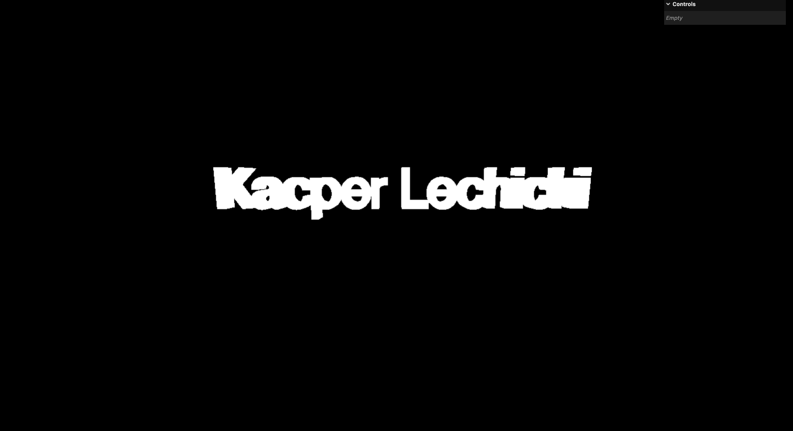
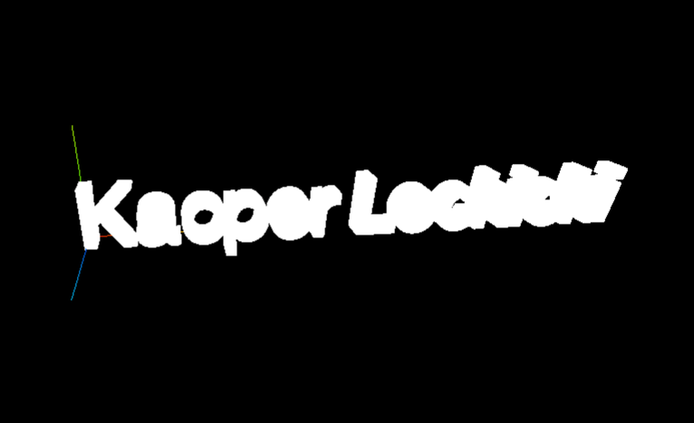

### 📁 **Name**: THREEJS_3D_Text

### 🎯 **Goal**: Create a 3D text using Three.js, a JavaScript library for building 3D graphics in web browsers. My goal is to gain practical experience with Three.js by developing a simple scene where I can manipulate and interact with 3D text objects. Throughout this project, I'll learn essential concepts such as scene setup, object creation, materials, lighting, and basic interactivity.

### 🛠️ **Tools**: Three.js, Javascript

### 📋 **Steps**:

### **Step 1**:

Created basic scene with cube and orbit controls.

### **Step 2**:

Imported FontLoader and got typeface from three resources.

### **Step 3**:

Imported TextGeometry and initialized it in callback function when FontLoader is done with loading imported font.
Next, created mesh with basic material and added text to the scene.

### **Step 4**:

Added AxesHelper to the scene. It can help while positioning elements.

